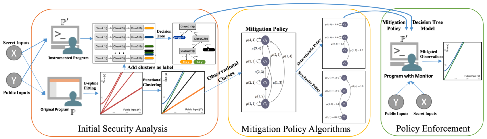

# SCHMIT - Quantitative Mitigation of Timing Side Channels
The repository for the implementations of SCHMIT (Side CHannel MITigator) [Quantitative Mitigation of Timing Side Channels](https://arxiv.org/abs/1906.08957), To appear in CAV'19.

The goal of SCHMIT is to improve the security based on entropy measure (such as Shannon Entropy) with considering the performance overheads.

SCHMIT consists of three components: 1) Initial Security Analysis, 2) Mitigation policy Synthesis, 3) Enforcement of mitigation policy.

<center></center>
<br>

## SCHMIT Overview
We overview the three components in SCHMIT.

###  Initial Security Analysis
For each secret value, we use B-spline basis in general to model arbitrary timing functions of secret values in the domain of public inputs, but we also allow simpler functional models such as polynomial functions. We use the non-parametric functional clustering with hierarchal algorithms to obtain the initial classes of observations or clusters. The clustering algorithm groups timing functions that are epsilon close to each other in the same cluster. The size of class is the number of secret values in the cluster. The l-norm distance between clusters forms the penalty matrix.

### Mitigation policy
We uses the policy algorithms, explained in Section 5 of paper to calculate the mitigation policy given the clusters, their sizes, and their distances. We use two types of algorithms: deterministic and stochastic. The deterministic algorithm is an instance of dynamic programming implemented in Java. The stochastic algorithms have three variants for three types of information theory measure. The variant based on Min-guess entropy is the main emphasis in this paper that implemented using Gurobi. The two other variants (for Shannon and Guessing entropies) are implemented in python using Scipy library. See Section 6(C) for further details.

### Enforcement of mitigation policy
In the first step, we characterize each class of observation with program internal properties. We use decision tree algorithms to characterize each class of observation with corresponding program internal features. Fig 2(b) in Section 2 is an example of decision tree model that characterizes each class of observation of Fig 1(b) in Section 2 with the basic block invocations at line 16 of modExp method. In the second step, we enforce the mitigation policy. This step can be done either with a monitoring system at run-time automatically or with a source code transformation semi-automatically. The enforcement uses the decision tree model and matches the properties en- abled during an execution with the tree model. Then, it adds extra delays, based on the mitigation policy, to the execution in order to enforce the mitigation policy. The result of mitigation can be verified by applying the clustering algorithm on the mitigated execution times.

### Running SCHMIT
We recommend to use the virtualBox machine file to run all the commands without issues.
The file can be obtained from the following link: [Artifacts](https://tinyurl.com/CAV19-193).
We go over the use of our tool using the example from overview section.

#### step (0)
time measurements-optional:
Use the command.txt file inside the folder (0.Programs) to apply commands and measure execution times.All time measurements are conducted on Intel NUC5i5RYH.

#### step (1) 
Initial Security Analysis:
```
cd 1.Initial_Analysis
Rscript functional_clustering.R Examples/results_overview_time.txt.csv 0 lp 1 50.0 hclust 1
```
where, args[1] is the execution time file (provided by us), args[2]=0 means to use 0-derivative (function itself), args[3,4]=lp 1 means to use the 1-norm distance, args[5]=50.0 is \epsilon parameter.

This step fits functional model for each secret value and calculates clusters. This results in a penalty matrix inside distance folder and a label file inside labels folder.

#### step (2)
Mitigation Policy:
```
cd ../2.Schmit_Deterministic
java -jar schmit_deterministic.jar 10 0.6 fun_label_overview.csv.csv fun_distance_overview.csv.csv
```
where args[1] is the number of clusters (obtained from the step 1), args[2] is the performance overhead bound (60\%), args[3] is the label file produced from the step 1, args[4] is the distance file produced from the step 1.

This step uses deterministic variant of Schmit to calculate the mitigation policy. This is the implementations of Algorithm 1 shown in page 10.

The result shows three different entropy measures: Min-guess, Guessing, and Shannon Entropies. Based on overview section, we use Shannon mitigation policy for this example.

#### step (3)
Enforcement:
```
cd ../3.Mitigation
```
#### step (3.1)
Instrumentation-optional:
# see the commands.txt inside the folder (1.instrumentations) to instrument overview example. 
This step provides the basic block calls for each secret value. We provide the output file of this step for the next steps (Feel free to skip).

#### step (3.2)
Decision Tree Learning:
```
cd ../2.Decision_tree_learning
python Classify.py --filename final_overview_classifications.csv --output overview_tree
dot -Tpng overview_tree_tree0.dot -o overview_tree.png
```
filename argument is obtained by combining label file from step 1 and the instrumentation result file from step 3.1. This step characterizes each cluster with basic block calls.

#### step (3.3) 
Enforcement:
```
cd ../3.Enforcement
javac overview.java
java -javaagent:mitigation-monitor.jar=empty,modExp,bblock overview > mitigated_time_new.txt
```
mitigation-monitor.jar is the run-time monitoring program to enforce the mitigation policy. Please see overviewPatch() method in stac.discriminer.callRecord.Stack class inside mitigation-monitor.jar
This code uses decision tree model and adds extra delays based on the mitigation policy.

#### step (3.4)
Final_Analysis:
```
cd ../4.Final_Analysis
cd Examples
java -jar convet_to_functionalData.jar mitigated_time.txt
cd ..
Rscript functional_clustering.R Examples/results_mitigated_time.txt.csv 0 lp 1 50.0 hclust 1
```
This step first converts the mitigated time measurement to functional data. Then, it applies the clustering algorithm to the mitigated time measurements.

Note: For precise time measurements of step (0) and (3.3, please use the NUC machine.